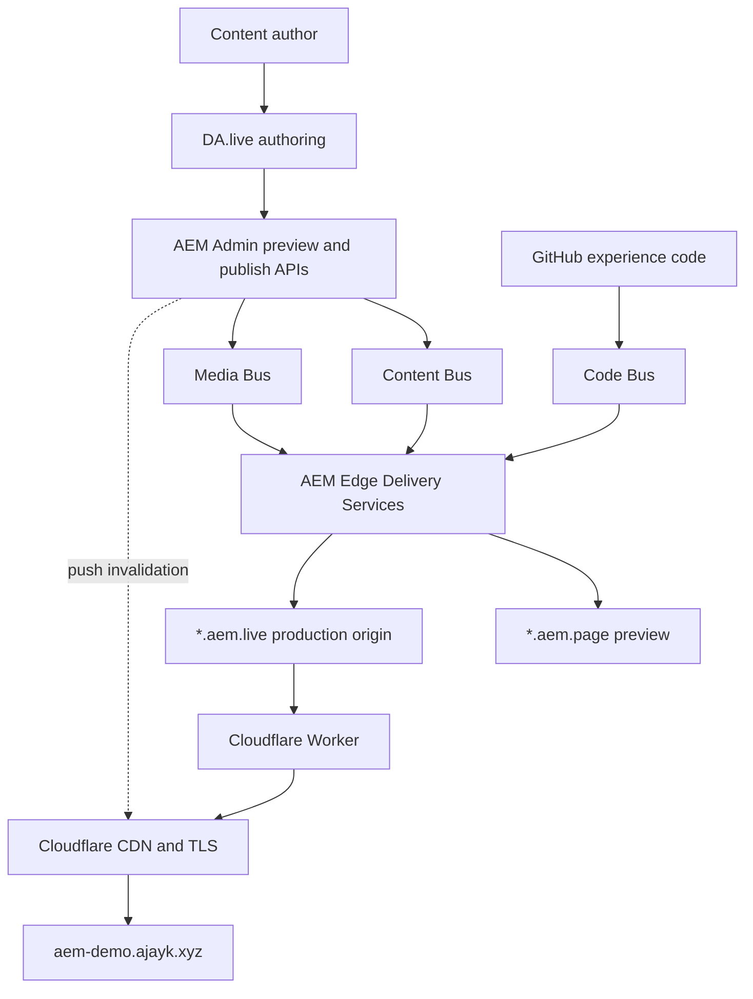

# AEM Automotive Experience Lab

An independent, hands-on Adobe Experience Manager engineering portfolio built
with AEM Edge Delivery Services. The project demonstrates how an enterprise
content platform can combine author-friendly publishing, composable frontend
components, high-performance edge delivery, and production CDN operations.

The current reference use case is an automotive newsroom: structured stories,
editorial search and filtering, rich article pages, responsive media, and a
documented path to analytics, experimentation, DAM, and full-stack services.

> This is an independent technical demonstration inspired by publicly
> documented enterprise content requirements. It is not affiliated with Ford
> Motor Company and does not represent Ford's private architecture. All demo
> names, stories, and generated automotive images are original and unbranded.

## Environments

| Environment | URL | Purpose |
| --- | --- | --- |
| Production | [aem-demo.ajayk.xyz](https://aem-demo.ajayk.xyz/) | Branded domain delivered through Cloudflare |
| AEM Live | [main--aem-demo--4j4yk.aem.live](https://main--aem-demo--4j4yk.aem.live/) | AEM production delivery origin |
| AEM Preview | [main--aem-demo--4j4yk.aem.page](https://main--aem-demo--4j4yk.aem.page/) | Content and code review tier |
| Authoring | [DA.live](https://da.live/#/4j4yk/aem-demo) | Document authoring and publishing |
| Source | [GitHub](https://github.com/4j4yk/aem-demo) | Versioned experience code and assets |

## Capabilities demonstrated

- DA.live document authoring with separate preview and publish operations
- AEM Edge Delivery Services content, media, and code delivery
- Authorable blocks decorated with semantic HTML, CSS, and vanilla JavaScript
- Automotive newsroom cards with client-side search and category filtering
- Structured article metadata with calculated reading time
- Responsive editorial galleries and optimized AEM picture renditions
- Progressive enhancement and delayed loading of non-critical behavior
- Keyboard-safe interactions, visible focus, semantic controls, and live status
- Git-based code review, ESLint, Stylelint, and branch-aware AEM delivery
- Cloudflare Worker routing, TLS, CDN caching, and AEM push invalidation
- Architecture decisions, content contracts, and implementation-status evidence

## Architecture



### Responsibility boundaries

| Layer | Responsibility |
| --- | --- |
| Authoring | Story copy, taxonomy, links, media selection, page composition |
| Experience code | Block decoration, interaction, accessibility, responsive layout |
| AEM delivery | Content transformation, optimized media, preview and live tiers |
| Cloudflare | Branded routing, TLS termination, edge caching and cache purge |
| GitHub | Source control, review history and immediate code distribution |

## How a request is served

1. A visitor requests `https://aem-demo.ajayk.xyz/`.
2. Cloudflare terminates TLS and checks its edge cache.
3. A cache miss is routed by the `aem-demo-cdn` Worker to the AEM Live origin.
4. AEM returns server-generated semantic HTML and optimized media references.
5. Critical styles and the first page section load eagerly.
6. JavaScript decorates authored tables into blocks such as `newsroom`,
   `article-meta`, and `story-gallery`.
7. Remaining sections, navigation, footer, fonts, and consent behavior load in
   progressively later phases.
8. The response is cached by Cloudflare; repeat requests are served at the edge.

## Authoring-to-production workflow

```text
Model content → Author in DA.live → Preview content → Develop and lint code
       → Review on *.aem.page → Merge main → Publish content
       → Push invalidation → Verify custom domain and cache status
```

Content and code are intentionally independent:

- Authors can revise and preview content without rebuilding the application.
- Developers can ship reusable behavior without hard-coding page copy.
- `*.aem.page` provides preview isolation.
- `*.aem.live` is the authoritative production origin.
- Cloudflare is invalidated after publishing so the branded domain receives the
  new version without waiting for its normal TTL.

## Automotive newsroom content model

Each story has a title, description, hero image, author, publication date,
category, tags, region, reading time, and destination URL. The authoring contract
is documented in [docs/newsroom-content-model.md](docs/newsroom-content-model.md).

### Newsroom block

Every authored row represents one story. The decorator:

- converts rows into semantic list items;
- optimizes authored images through AEM media delivery;
- derives the available filters from authored categories;
- builds searchable text from the card content;
- updates a polite live-region result count; and
- preserves useful content when JavaScript or individual cells are missing.

### Article metadata block

Authored field/value rows become a definition list. Labels remain available to
assistive technology, while values form a compact editorial byline. If reading
time is not authored, the block calculates it from page content.

### Story gallery block

Image and caption rows become semantic figures with responsive picture sources,
descriptive alternative text, and readable captions.

## Block inventory

| Block | Responsibility |
| --- | --- |
| `hero` | Promotes the opening image, title, summary, and calls to action |
| `newsroom` | Searchable and filterable editorial story collection |
| `article-meta` | Article byline, taxonomy, region, date, and reading time |
| `story-gallery` | Responsive editorial figures and captions |
| `cards` | General reusable capability and workflow cards |
| `columns` | Responsive multi-column architecture content |
| `tabs` | Keyboard-accessible grouped demonstrations |
| `accordion` | Disclosure-based architecture explanations |
| `stats` | Outcome and implementation metrics |
| `status` | Implemented, simulated, and planned capability reporting |
| `fragment` | Shared navigation and footer composition |
| `metadata` | Removes delivery metadata from rendered page content |

## Performance strategy

- Server-delivered content remains readable before JavaScript executes.
- The first section and likely LCP image load eagerly.
- Blocks load only when their sections are processed.
- AEM supplies responsive image renditions instead of full-size source images.
- Fonts are delayed on smaller first visits and cached for later sessions.
- Consent and other non-critical behavior load after the main experience.
- Cloudflare serves repeat production requests from its global edge cache.
- Heavy SPA hydration is avoided for content-first experiences.

## Accessibility strategy

- Native buttons and search inputs are used for newsroom controls.
- Category state is exposed with `aria-pressed`.
- Search results are announced through a polite status region.
- Cards use semantic lists and headings.
- Galleries use figures, captions, and authored alternative text.
- Tabs and accordions implement keyboard and ARIA relationships.
- Focus is highly visible and colors maintain strong contrast.
- Layouts reflow from mobile to wide desktop without hiding content.

## CDN and invalidation

The custom domain uses a Cloudflare Worker in front of the AEM Live origin. A
restricted Cloudflare purge token is registered in the AEM site CDN
configuration. Publishing can therefore trigger push invalidation for changed
paths. Secrets and account identifiers are intentionally excluded from source.

Verification checks include:

- the first post-purge request returns `CF-Cache-Status: MISS`;
- the repeat request returns `CF-Cache-Status: HIT`;
- title, canonical page content, and last-modified values match AEM Live; and
- custom-domain responses continue to use HTTPS.

## Local development

Prerequisites: Node.js, npm, Git, and access to the associated AEM project.

```sh
npm install
npx -y @adobe/aem-cli up
```

The local proxy opens at `http://localhost:3000` and combines local experience
code with AEM preview content.

Run both code-quality checks before committing:

```sh
npm run lint
```

## Repository structure

```text
blocks/                 Authorable block JavaScript and scoped CSS
docs/                   Content contracts and architecture notes
fonts/                  Locally served font assets
icons/                  Interface icons
media/newsroom/         Original unbranded editorial image sources
scripts/scripts.js      Project decoration and loading orchestration
scripts/aem.js          Adobe-provided AEM runtime (not customized)
styles/                 Global, font, and delayed style layers
```

## Architecture decisions

### Vanilla JavaScript for content-first pages

The newsroom does not require a client framework. Server HTML remains crawlable
and resilient, while JavaScript adds interaction. A bounded React block can be
introduced later for an application-like feature without hydrating the site.

### Authored content instead of hard-coded story data

Editorial teams control copy, ordering, media, and taxonomy. Developers maintain
stable decoration contracts and handle incomplete authoring defensively.

### BYO CDN in front of AEM Live

Cloudflare supplies the custom domain and operational control point while AEM
Live remains the authoritative origin. This makes routing, caching, security
policy, and invalidation responsibilities explicit.

### Honest integration boundaries

The repository distinguishes working features from demonstrations and roadmap
items. It does not claim access to licensed Adobe Analytics, AEM Assets,
GenStudio, Frame.io, or a private enterprise AEM environment.

## Role alignment

The current release supplies evidence for AEM authoring, component development,
HTML, CSS, JavaScript, HTTP/CDN behavior, accessibility, responsive design,
testing, troubleshooting, architecture communication, and production delivery.

Planned releases extend the portfolio toward common full-stack AEM role needs:

1. Analytics event taxonomy and EDS experimentation.
2. Spring Boot REST service, PostgreSQL, OpenAPI, health checks, and tests.
3. A bounded React experience loaded from an authorable block.
4. Traditional AEM as a Cloud Service sample using HTL, Sling Models, OSGi,
   editable templates, Dispatcher configuration, and AEM Mocks.

## Implementation status

| Capability | Status |
| --- | --- |
| DA.live authoring and preview/publish workflow | Implemented |
| Responsive AEM block system | Implemented |
| Automotive newsroom search and filters | Implemented |
| Article metadata and responsive gallery | Implemented |
| GitHub code delivery | Implemented |
| Cloudflare custom domain and Worker | Implemented |
| Automated Cloudflare push invalidation | Implemented |
| Adobe Analytics event layer | Planned |
| EDS experimentation | Planned |
| AEM Assets API integration | Architecture demonstration planned |
| Spring Boot and PostgreSQL integration | Planned |
| Traditional AEM component sample | Planned |

## References

- [AEM Edge Delivery Services developer tutorial](https://www.aem.live/developer/tutorial)
- [AEM architecture](https://www.aem.live/docs/architecture)
- [AEM project anatomy](https://www.aem.live/developer/anatomy-of-a-project)
- [Keeping web performance at 100](https://www.aem.live/developer/keeping-it-100)
- [Blocks, sections, and auto-blocking](https://www.aem.live/developer/markup-sections-blocks)
- [BYO CDN with Cloudflare Workers](https://www.aem.live/docs/byo-cdn-cloudflare-worker-setup)
- [AEM experimentation](https://www.aem.live/docs/experimentation)
